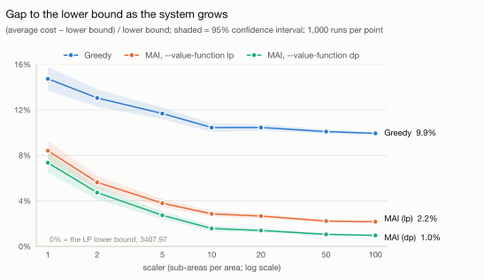

# Benchmarks

Results of the Python port on the paper's synthetic instance (10 areas, 2 agent types,
10 time steps, seed 395), with a check against the original C++ at every point.

## Setup

| | |
|---|---|
| Machine | Apple M4 (10 cores), 16 GB RAM, macOS 27.0.1 |
| Python | 3.14.5, NumPy 2.4.6, SciPy 1.17.1 (HiGHS) |
| C++ | the shared `main.cpp`/`stdafx.cpp`, built by `tests/cpp_harness/build.py` with Homebrew GCC 15.2 (`-O2`) |
| Runs | 1,000 Monte-Carlo runs per policy per scaler |
| LP solution | `tests/data/store_lp-seed395.out.gz` (identical to what `gen.py` produces on this setup) |

## 1. Results: Greedy vs MAI as the system grows

"Gap" is (average cost − lower bound) / lower bound, with lower bound 3407.97. The paper's claim is that MAI's gap
shrinks towards 0 as the scaler grows.

<picture>
  <source media="(prefers-color-scheme: dark)" srcset="benchmarks/gap-dark.svg">
  
</picture>

### How to read it

Each line is one policy. Lower is better: 0% would mean the policy does as well as the LP lower bound, and no
policy can go below 0 on average.

The x-axis is the scaler, the number of sub-areas (and agents) each area is split into. It's on a log scale so
that 1, 2 and 5 get as much room as 50 and 100.

The shaded band around each line is the 95% confidence interval from the 1,000 runs. It narrows as the scaler
grows because each run averages over more sub-areas. Where two bands don't overlap, the difference isn't noise.

### What it shows

MAI beats Greedy at every scaler, by 6 to 8 percentage points of gap. Greedy levels off at about a 10% gap.
MAI's gap shrinks from 8.4% at scaler 1 to 2.2% at scaler 50 and stays there at scaler 100. These numbers use
the value function of one particular LP solution (HiGHS), and the entries the LP leaves arbitrary affect MAI
(see the README); section 3 shows how much MAI's results depend on the solver.

Movement adaptions (agents re-routed to keep the moves feasible) average 0.08 per run for Greedy and 0.21 for
MAI at scaler 1, and are 0 for both policies by scaler 20. Slackness (column 11) is −58.15.

### Exact numbers

Costs are the average total cost ± the 95% confidence half-width.

| scaler | Greedy | MAI | Greedy gap | MAI gap |
|---:|---:|---:|---:|---:|
| 1 | 3910.04 ± 35.41 | 3694.55 ± 29.37 | 14.73% | 8.41% |
| 2 | 3852.71 ± 25.96 | 3599.99 ± 19.70 | 13.05% | 5.63% |
| 5 | 3806.05 ± 17.52 | 3537.33 ± 12.11 | 11.68% | 3.80% |
| 10 | 3764.07 ± 13.37 | 3505.49 ± 8.60 | 10.45% | 2.86% |
| 20 | 3764.24 ± 9.90 | 3498.76 ± 6.44 | 10.45% | 2.66% |
| 50 | 3751.84 ± 6.27 | 3483.76 ± 3.86 | 10.09% | 2.22% |
| 100 | 3746.69 ± 4.28 | 3481.93 ± 2.67 | 9.94% | 2.17% |

## 2. Python matches the C++ at every point

At all 7 scalers above, the C++ program, run on the same store file, gives the same row, bit for bit, in
every column. That covers both averages, both confidence intervals,
both adaption counts, both gaps, the lower bound and the slackness.

## 3. With a real CPLEX solution

The sections above use LP solutions from HiGHS. To check the port against the authors' own setup, IBM CPLEX 22.2
(academic edition) was installed on two Linux machines and the authors' unmodified `main.cpp`/`stdafx.cpp` were
built on each with real CPLEX:

- ARM64: an NVIDIA DGX Spark, Ubuntu 24.04, GCC 13.3 (`-O2 -ffp-contract=off`), Boost 1.83;
- x86-64: a Windows laptop under WSL, Ubuntu 22.04, GCC 11.4 (`-O2`).

On each, a short driver called their `cplexEquivalentProblem` with CPLEX's default settings to solve the LP and
write the store file, and their simulator ran on it. The two machines returned different optimal solutions.
`output.txt` in this repository is the x86 run's log at scaler 1.

### The port against the authors' build

On both CPLEX solutions the Python port and the authors' build agree bit for bit on eight of the ten columns:
both averages, both adaption counts, both gaps, the lower bound and the slackness. The two confidence intervals
differ in the last bit (about 2e-16 relative) because the C++ takes the t-quantile from Boost and the port from
SciPy. On the x86 solution the port also prints every `Gradients for t=...` line and the slackness in
`output.txt` exactly. `tests/test_against_cpp.py` checks all of this for scalers 1, 2 and 5.

### CPLEX against HiGHS

Both CPLEX runs give the objective values 371.653 and 3036.31, and where the LP has a unique answer CPLEX agrees
with HiGHS: the multipliers μ match to 2e-11. The value function is another matter. On the ARM solution, 8,039 and 7,674 of the 10,200 entries per agent type differ from HiGHS, and
CPLEX leaves 23 and 3,243 entries at the ±100,000 bound where HiGHS leaves 70 and 115. On the x86 solution, 7,664
and 7,885 differ.

That shows up directly in MAI. Greedy is the same in every case, since it doesn't use the value function.

| scaler | MAI gap, CPLEX ARM | MAI gap, CPLEX x86 | MAI gap, HiGHS |
|---:|---:|---:|---:|
| 1 | 11.20% | 10.93% | 8.41% |
| 2 | 9.45% | 9.15% | 5.63% |
| 5 | 8.04% | 7.70% | 3.80% |
| 10 | 7.42% | 7.19% | 2.86% |
| 20 | 7.36% | 7.05% | 2.66% |
| 50 | 6.92% | 5.73% | 2.22% |
| 100 | 6.86% | 5.47% | 2.17% |

MAI's gap at scaler 100 ranges from 2.2% to 6.9% depending on which optimal LP solution the solver happened to
return.

### Which optimal solution comes back

The gradients and slackness depend on the exact optimal solution, and CPLEX's settings and machine change which
one it returns. On ARM, nine settings gave seven different slackness values; the x86 default run gave another:

| CPLEX 22.2 run | slackness |
|---|---:|
| x86, default (the run in `output.txt`) | 142.982 |
| ARM, default (concurrent, 20 threads; barrier wins) | 109.672 |
| ARM, 8 threads | 128.300 |
| ARM, 4 threads | 138.285 |
| ARM, 2 threads | −63.638 |
| ARM, 1 thread | −92.542 |
| ARM, dual simplex | −92.542 |
| ARM, primal simplex | 191.118 |
| ARM, barrier | 126.087 |
| ARM, barrier, 1 thread | −63.638 |

The authors' package has no run log and no LP solution file, and their `Readme.pdf` gives no reference numbers
(it only says the slackness should be zero). Their own LP solution, and with it their exact MAI numbers, can't be
recovered from what they shared.

## Reproducing

```bash
# LP solve
python3 gen.py

# Python simulation on the stored LP solution
python3 simulate.py 20 --store tests/data/store_lp-seed395.out.gz --no-write
```

The numbers in this file are in `benchmarks/results.tsv` (full precision). To redraw the charts
from it (needs matplotlib):

```bash
python3 benchmarks/plot.py
```

The ARM CPLEX solution is in `tests/data/store_cplex22-seed395.out.gz`, and the authors' build's rows for it are
in `benchmarks/cplex_results.tsv` and `tests/data/cpp_reference_cplex.tsv`. The x86 solution is in
`tests/data/store_cplex22-x86-seed395.out.gz`, with its rows in `tests/data/cpp_reference_cplex_x86.tsv`. Both
row files cover every scaler from 1 to 100.

For the C++ side, build it with `tests/cpp_harness/build.py` (see the README), copy one of the
`tests/data/store_*.out.gz` files, uncompressed, to `<build dir>/test23/store/store_valueFuncs-seed395.out`, and
run `./edit <scaler>` from the build directory. The result row is appended to
`test33/long-term-performance-cost.out` with 17 significant digits.
